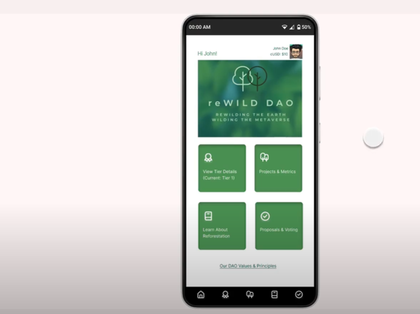
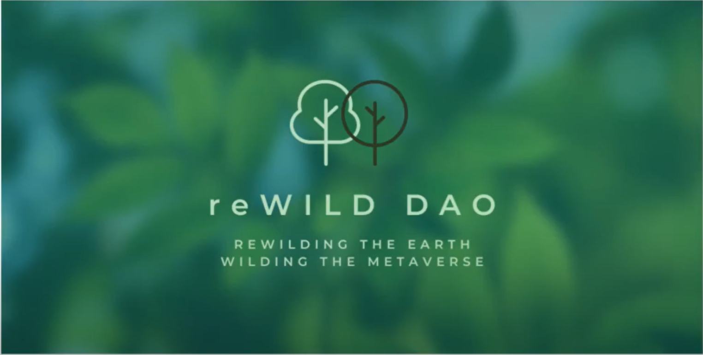

# reWILD DAO

## Project Description
For our DAO Investors, we enable easy participation in a natural carbon capture process, through our support of a forest creation service that is continuously tracked and transparent, to recreate the lungs of the earth and support new forest development on non-productive agriculture land. Bringing together a community of individuals to pool their money and vote on usage of forest creation. The DAO is a global and scalable way to restore forest cover. It provides the opportunity to participate in conservation by creating real world forests and experiencing their digital recreation in the metaverse. reWILD DAO is a crowdfunding ecosystem in the blockchain which is orchestrated in a smart contract. The smart contracts are developed in Solidity

Features & Benefits: Rewilding, Carbon Capture, Education/ contribution, Transparency, Monitoring & Tracking Tools, Wilding the Metaverse

## Demo 

## Pitch video

## Smart contract addresses: 
The smart contracts are accessible on the celo blockchain 

Smart contract 1 address:
Smart contract 2 address: 
Smart contract 2 address: 

## Tech Stack 
* Solidity 
* Remix IDE 
* Openzepplin 
* Javascript 

## Files
This repo contains 4 files namely:
* `Script1_voting_ballet.sol` : Solidity file for the smart contract to vote on proposals
* `Script2_Script2_Accept_donations.sol` : Charity smart contract to accept donations 
* `createBytes.js` : Convert strings to Byte32
* `parseBytes.js` : Convert Byte32 to strings 

The conversion between Byte32 and strings would be used along with the react-native application. Byte32 is preferrable over strings in smart contracts since it saves on gas fees. 
 
Use Remix IDE to test and deploy the code

##  Smart Contract 1 
### Description: 
Main components of the `Script1_voting_ballet.sol` include:
* `giveRightToVote` : Function returns a boolean (i.e. true or false). If true, a voter as already voted or delegate his or her right to vote to another voter, and if false, voter has not voted yet and has a weight (voting power) = 1
* `delegate` : Delegate votes to another voter
* `vote` : Give vote (including votes delegated to self) to proposal `proposals[proposal].name`
* `winningProposal` : Computes the winning proposal taking all previous votes into account
* `winnerName` : Calls the `winningProposal()` function to get the index of the winner contained in the proposals array and then returns the name of the winner

## Smart Contract 2
### Description: 
Main components of the `Script2_Accept_donations.sol` include:
* `fund` : Allows addition of funds to smart contract with a requirements of minimum spend
* `getVersion` : Get decentralized chainlink orcale version which will be used to get the price conversion between ETH and USD 
* `getPrice` : Function to get price of ETH in USD (values returned in Wei, and get converted to ETH)
* `getConversionRate` : FUnction that convert a given input amount ETH and return converted value to USD 
* `withdraw` : FUnction allows the owner of the smart contract (in this case reWild DAO) to withdraw the deposits to the owner (chairty) wallet address 

